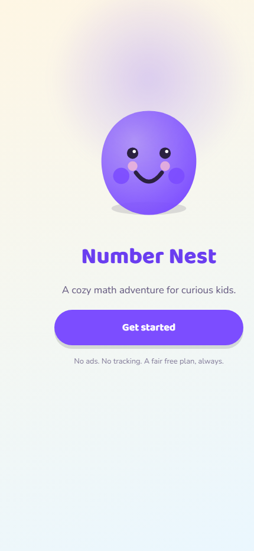
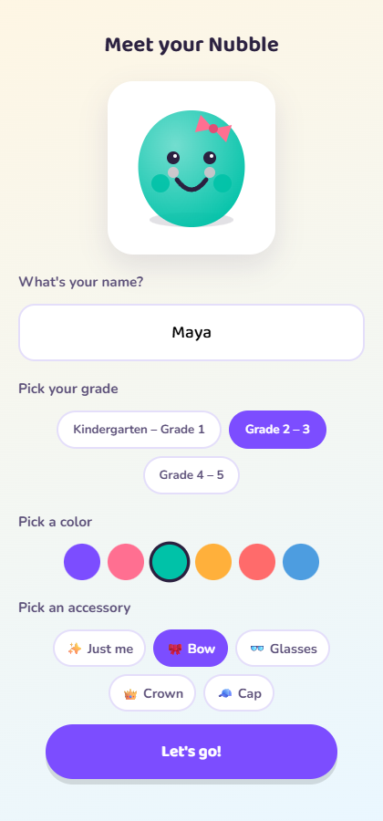
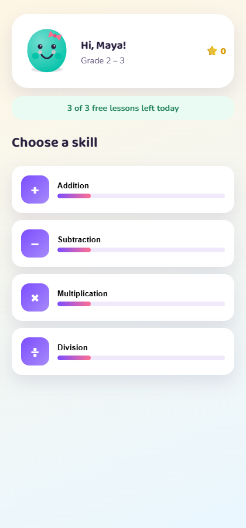
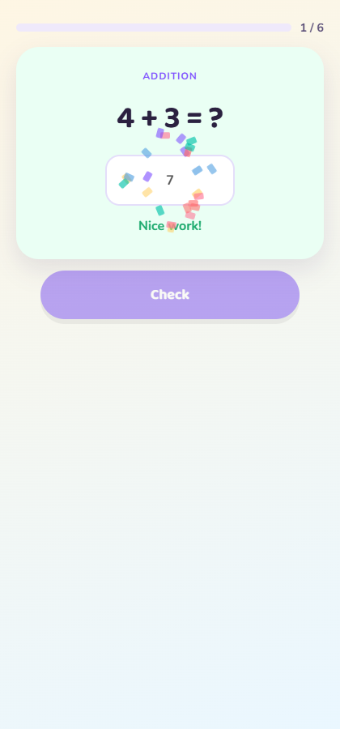
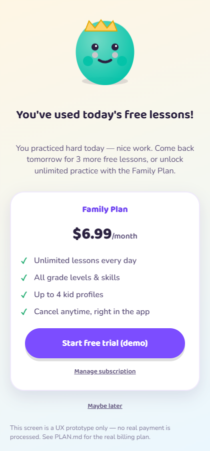

# Number Nest

A polished, ad-free math learning game for kids (K-5), built to match the category defined by
apps like ["Math Learner: Learning Game"](https://apps.apple.com/us/app/math-learner-learning-game/id1148728253)
— but with fairer monetization and original IP. This repo contains the research, the cross-platform
plan, and a playable MVP that proves out the core loop.

|  |  |
|---|---|
|  |  |
|  |  |
|  |  |

## Start here
1. **[`RESEARCH.md`](RESEARCH.md)** — deep dive on the reference app, its business model and
   reviews, five direct competitors, and evidence-based platform revenue-potential ranking.
2. **[`PLAN.md`](PLAN.md)** — product name/IP, platform rollout order (iOS → Android → Windows
   Store → Steam, and why), shared-engine architecture, MVP scope, hard-problem cost estimates,
   and open questions.
3. **[`LOG.md`](LOG.md)** — running milestone/learning/bug log kept for the life of the project.
4. **[`app/`](app/)** — the MVP itself (TypeScript + Vite, zero backend). See `app/README.md` to
   run it locally.
5. Open **Issues** on this repo — blocking product/business questions that need a human decision
   before Phase 1 (real iOS build) can start.

## TL;DR platform priority
**iOS first** (only platform with a proven direct revenue comparable in this niche), **Android
second** (reach, lower ARPU), **Windows Store third** (cheap byproduct of the same web codebase,
not a revenue driver), **Steam last/optional** (no evidence of a viable kids-math market there).
Full reasoning in `RESEARCH.md` §3.
