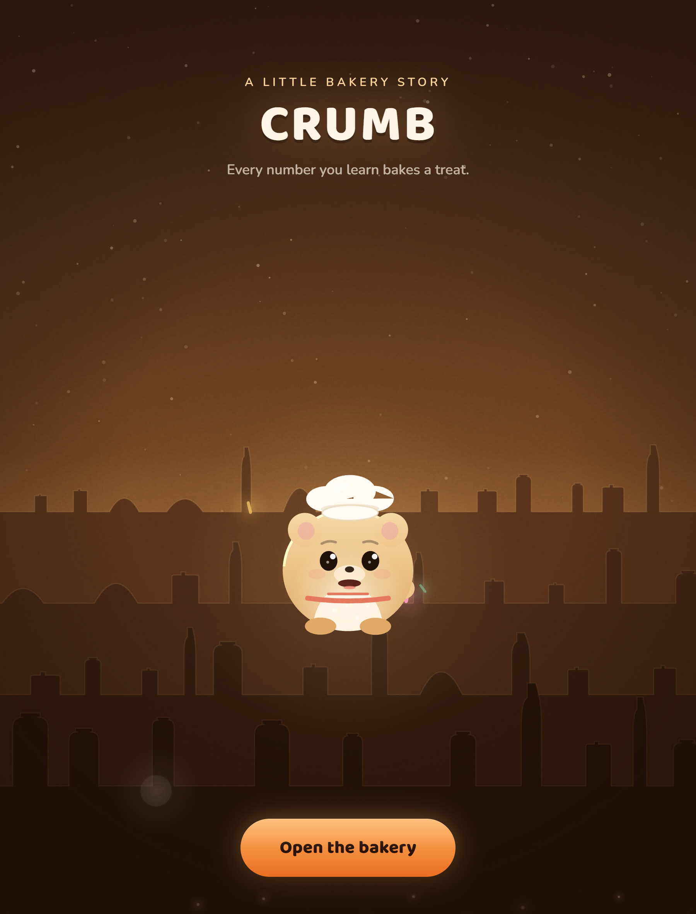
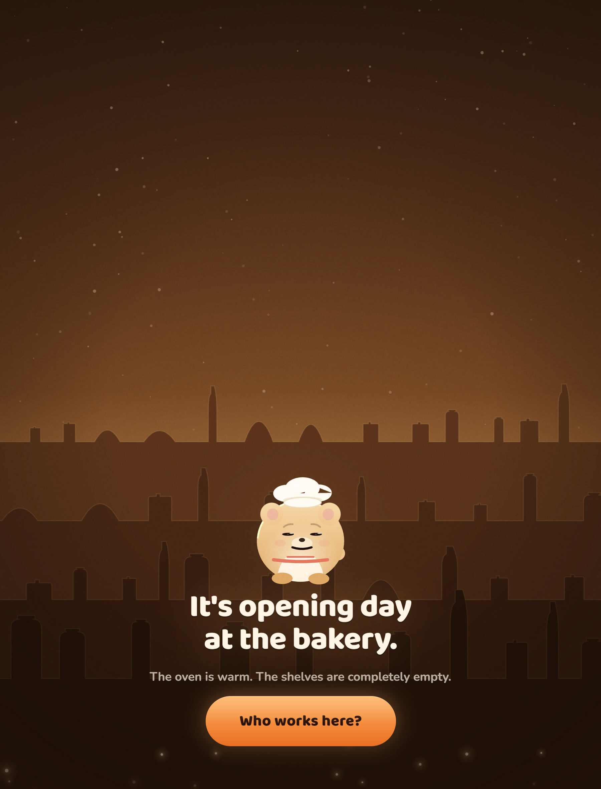
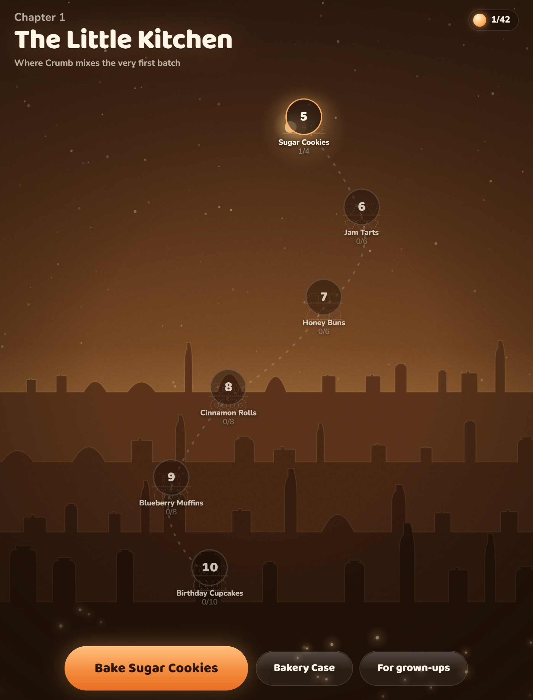
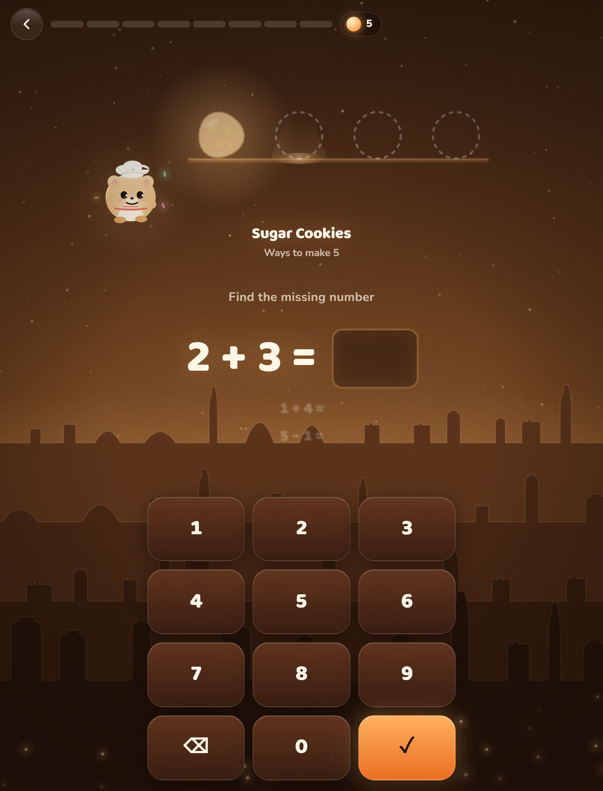
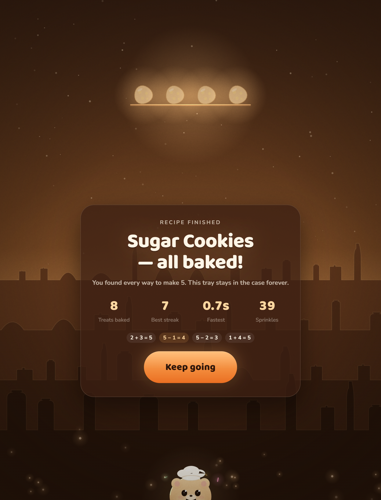
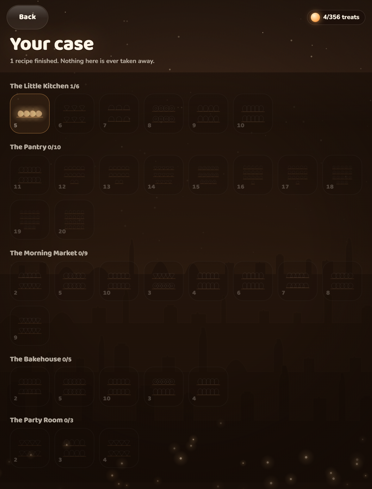

# Crumb's Bakery — MVP

A second, parallel vertical slice of the same K-5 math game, with the narrative layer fully
replaced. Same engine, same pedagogy, same craft rules; different story.

The sibling MVP in [`../app/`](../app/) is **Pipkin** — fallen counting-stars, pips and
constellations. This one is **Crumb's Bakery** — an empty shop, an order board and treats coming
out of an oven. It exists because the astronomy premise tested as too abstract for a
five-year-old. Neither replaces the other. See [`../GAME-DESIGN-BAKERY.md`](../GAME-DESIGN-BAKERY.md)
for the full design rationale and the Pipkin → Crumb mapping.

|  |  |
|---|---|
|  |  |
|  |  |
|  |  |

## Run it

```powershell
npm install
npm run dev       # http://localhost:5174
npm run build     # type-checks + production build to dist/
npm run preview   # serve the production build on :5174
```

Port 5174, so it can run side by side with the Pipkin MVP on 5173.

## What's implemented

- **Opening-day onboarding** — meet Crumb, bake one treat before being asked anything, then pick
  an age band. The first question is answered before the first form field.
- **The order board** (`src/screens/map.ts`) — chapters as rooms, recipes as order tickets, each
  ticket drawing a live thumbnail of its own shelf. Restocking stale recipes is always the
  first-offered action.
- **The Recipe Card** (`src/screens/lesson.ts`) — the fact-family ladder. Correct answers bake a
  treat onto a shelf grid where **additions sit directly above the subtractions that undo them**.
- **The Bakery Case** (`src/screens/case.ts`) — the permanent collection screen, grouped by room.
- **Freshness / spaced repetition** (`src/game/mastery.ts`) — fresh → stale → re-baked → *house
  special*. The review scheduler is the fiction, not something hidden behind it.
- **Procedural treat art** (`src/render/treats.ts`) — cupcakes, cookies, doughnuts, pies and buns
  drawn from primitives, shape derived from the recipe name, sprinkles fading first as a treat
  goes stale, gold gleam on house specials.
- **Crumb** (`src/render/crumb.ts`) — a fully rigged procedural character: springs on body, ears,
  eyes, pupils, brows, and a separate spring for the chef's toque so it lags his head. Blinks,
  breathes, tracks the pointer, has moods.
- **The room** (`src/render/scenery.ts`) — four parallax layers of shelf planks with jars, bowls,
  bottles and tins, five room palettes that cross-fade, rising flour motes, film grain, vignette.
- **A parents' area** behind a simple gate — facts mastered, recipes finished, accuracy, fluent
  recall, a week bar chart, the facts worth practising together, sound and reduced-motion
  toggles, and a plain statement that nothing leaves the device.
- **Local, offline persistence** via `localStorage` (`src/game/store.ts`). No account, no
  backend, no analytics, no ads.
- **Accessibility**: the canvas is `aria-hidden` and every piece of meaning on it is mirrored in
  the DOM. Full keyboard play. `prefers-reduced-motion` honoured throughout.

## What's intentionally NOT in the MVP

Game modes 2–5 (Tray Frames, Balance, Order Line, Rush Hour), handwriting recognition, payments,
native shells, multi-language content and any backend — see `../PLAN.md` for the costed reasoning
on each, all of which applies unchanged.

## Architecture

Identical to the sibling MVP, which is the point:

- **`world.ts`** owns the persistent canvas world — scenery, Crumb, particles, the shelf. It
  survives screen changes; screens ask it to move things.
- **`render/stage.ts`** is the draw-order registry. `stage.add(fn, z)` returns an unsubscribe.
- **`screens/*`** are factories returning `{ element, mounted?, destroy? }` — no framework.
- **`game/curriculum.ts`** is the only place that knows what a fact family is; `game/mastery.ts`
  is the only place that knows when one is due.

Zero runtime dependencies beyond the two webfonts. Vite and TypeScript are the whole toolchain.

## QA notes

The complete flow (title → onboarding → order board → lesson → summary → Bakery Case → parents →
landscape) was driven end-to-end with a scripted Puppeteer pass against the production build, at
tablet portrait and at a short landscape viewport. Screenshots are in `docs/screenshots/`. Zero
page or console errors.

Real bugs the visual pass caught and fixed, none of which were visible in code review:

1. **Apron straps ran across Crumb's face.** A one-circle character has no shoulders, so straps
   drawn bib-to-head land on the cheeks. Replaced with a bib trim line.
2. **Treats floated above the plank.** The plank y was hard-coded; different treat shapes have
   different resting heights. Now driven by an exported `TREAT_BASE` per shape.
3. **The active-slot indicator was a grey lens.** A large soft radial gradient over a dark
   background reads as a smudge. Replaced with a tight lit ellipse on the plank plus a short
   light cone.
4. **Shelf thumbnails spilled outside their order-ticket discs.** `drawStatic` now does a second
   fit pass measuring the treat radius against the disc.
5. **The backdrop looked like castle battlements.** Took three attempts — see
   `../GAME-DESIGN-BAKERY.md` §3.1. Any stepped horizon at a constant step height reads as
   crenellation; the fix is dead-flat planks with varied crockery on them.
6. **"Sugar Cookies" were plated as buns.** Treat shape is now derived from the recipe name.
7. **The keypad fell off the bottom at 780×420.** Added a short-screen breakpoint and a
   two-column landscape grid.

Prior tooling learnings that still apply: give every viewport its own browser context
(`localStorage` is shared across pages in one profile), allow ~1500 ms for animations to settle
before capturing, and **never seed `localStorage` then reload** — the app flushes state on
`pagehide`, so the outgoing page overwrites the seed. Patch the live store through the
`window.crumb` hook instead.
